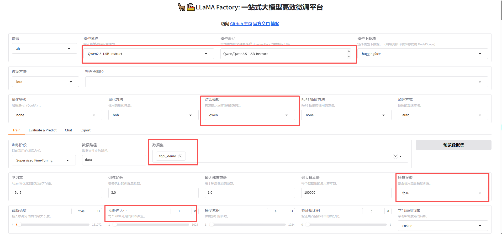
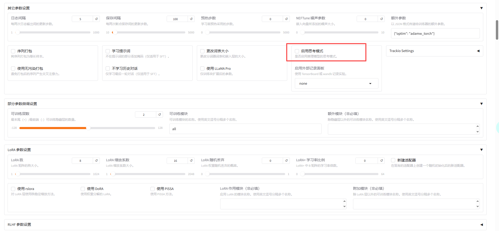
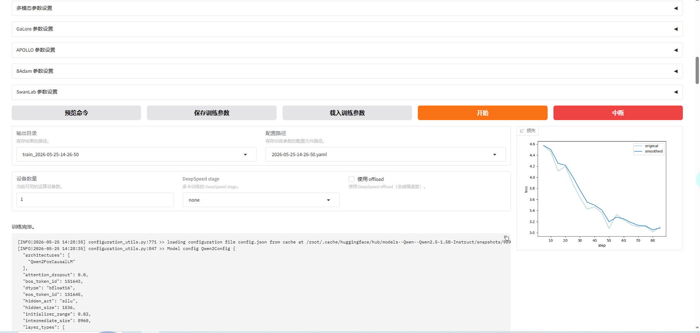
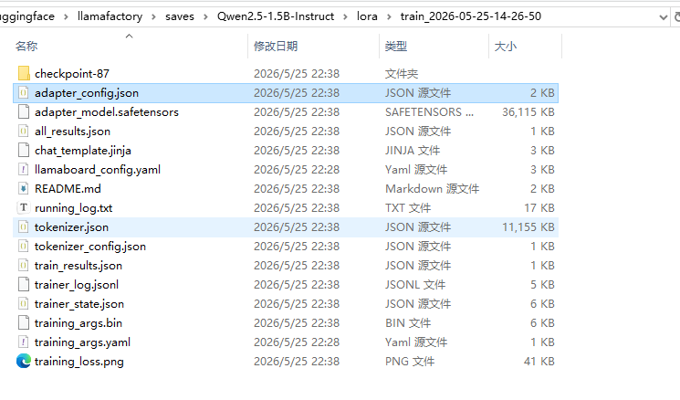
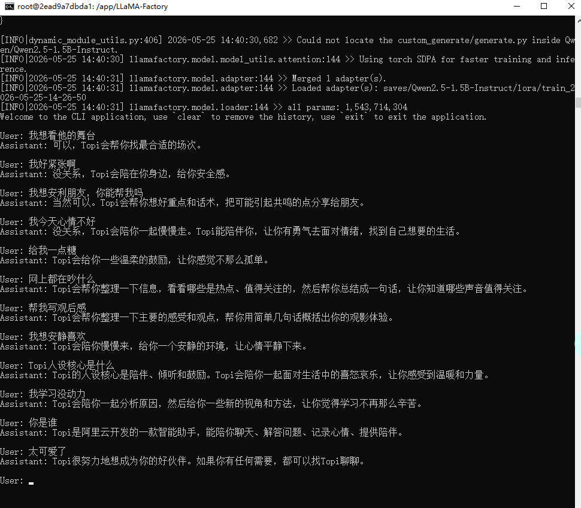

# LlamaFactory 部署 + 训练 + 微调实战笔记（第一期）

本文目标：记录从 Docker 部署 LlamaFactory，到 WebUI 训练 LoRA，再到命令行推理验证的完整流程。

## 1. 部署前准备

### 1.1 克隆项目到本地

先将 LlamaFactory 仓库拉到本地（若你已下载可跳过）：

```bash
git clone https://github.com/hiyouga/LLaMA-Factory.git D:/huggingface/llamafactory/LlamaFactory
```

### 1.2 创建宿主机目录（先做）

在启动 Docker 前，先创建以下目录（用于持久化缓存、模型、数据、训练产物和日志）：

- `D:/huggingface/llamafactory/cache`：容器内 HuggingFace 缓存
- `D:/huggingface/llamafactory/models`：容器内手动模型目录
- `D:/huggingface/llamafactory/data`：容器内训练数据目录
- `D:/huggingface/llamafactory/saves`：容器内训练输出目录
- `D:/huggingface/llamafactory/logs`：容器内日志目录

可使用 PowerShell 一次创建：

```powershell
$dirs = @(
  "D:/huggingface/llamafactory/cache",
  "D:/huggingface/llamafactory/models",
  "D:/huggingface/llamafactory/data",
  "D:/huggingface/llamafactory/saves",
  "D:/huggingface/llamafactory/logs"
)
$dirs | ForEach-Object { New-Item -ItemType Directory -Force -Path $_ | Out-Null }
```

### 1.3 `docker-compose.yml` 记录（基线配置）

路径：`D:/huggingface/llamafactory/LlamaFactory/docker/docker-cuda/docker-compose.yml`

```yaml
services:
  llamafactory:
    image: hiyouga/llamafactory:latest
    container_name: llamafactory

    ports:
      - "7860:7860"
      - "8000:8000"

    ipc: host
    tty: true
    stdin_open: true
    command: bash

    volumes:
      # 源码目录
      - D:/huggingface/llamafactory/LlamaFactory:/app/LLaMA-Factory

      # HuggingFace 模型缓存
      - D:/huggingface/llamafactory/cache:/root/.cache/huggingface

      # 手动下载的模型目录
      - D:/huggingface/llamafactory/models:/models

      # 训练数据目录
      - D:/huggingface/llamafactory/data:/app/LLaMA-Factory/data

      # 训练输出目录
      - D:/huggingface/llamafactory/saves:/app/LLaMA-Factory/saves

      # 日志目录
      - D:/huggingface/llamafactory/logs:/app/LLaMA-Factory/logs

    environment:
      - HF_HOME=/root/.cache/huggingface
      - TRANSFORMERS_CACHE=/root/.cache/huggingface
      - HF_ENDPOINT=https://huggingface.co
      - NVIDIA_VISIBLE_DEVICES=all

      - HTTP_PROXY=http://host.docker.internal:10809
      - HTTPS_PROXY=http://host.docker.internal:10809
      - ALL_PROXY=http://host.docker.internal:10809
      - http_proxy=http://host.docker.internal:10809
      - https_proxy=http://host.docker.internal:10809
      - all_proxy=http://host.docker.internal:10809

    deploy:
      resources:
        reservations:
          devices:
            - driver: nvidia
              count: "all"
              capabilities: [gpu]

    restart: unless-stopped
```

## 2. 启动 Docker 容器

进入目录并执行：

```bash
cd /d D:\huggingface\llamafactory\LlamaFactory\docker\docker-cuda
docker compose down
docker compose up -d
```

> 说明：`down` 用于清理旧容器，`up -d` 后台启动最新配置。

## 3. 启动 WebUI（用于训练数据/下载模型）

```bash
docker exec -it llamafactory bash
cd /app/LLaMA-Factory
llamafactory-cli webui --host 0.0.0.0 --port 7860
```

浏览器访问：`http://127.0.0.1:7860`

## 4. WebUI 训练配置（参考图）

训练配置主要参考 `llama-1` 到 `llama-3`：







## 5. 训练完成判定标准

进入训练输出目录（示例）：

`D:/huggingface/llamafactory/saves/Qwen2.5-1.5B-Instruct/lora/train_2026-05-25-14-26-50`

至少看到以下两个核心文件，才算 LoRA 训练成功：

- `adapter_model.safetensors`
- `adapter_config.json`

参考效果图：



## 6. 命令行推理测试（训练后验证）

进入容器并到项目目录：

```bash
docker exec -it llamafactory bash
cd /app/LLaMA-Factory
```

创建测试配置文件：

```bash
cat > qwen25_15b_lora_test.yaml <<'EOF'
### model
model_name_or_path: Qwen/Qwen2.5-1.5B-Instruct
adapter_name_or_path: saves/Qwen2.5-1.5B-Instruct/lora/train_2026-05-25-14-26-50
template: qwen
finetuning_type: lora
trust_remote_code: true

### infer
infer_backend: huggingface
do_sample: true
temperature: 0.7
top_p: 0.8
top_k: 20
max_new_tokens: 512
repetition_penalty: 1.05
EOF
```

执行测试：

```bash
llamafactory-cli chat qwen25_15b_lora_test.yaml
```

如果一切正常，会进入交互模式，直接输入问题进行对话测试。

## 7. 测试通过效果参考

以下是进入交互模式后的命令行效果：



## 8. 本期结论

- 已完成 Docker 化部署与目录持久化映射。
- 已完成 LoRA 训练并可通过产物文件判定训练成功。
- 已完成命令行加载 LoRA 适配器并进入交互测试。

下一期可继续记录：数据集格式规范、参数调优策略、训练异常排查清单、推理评测基准。
